# NXP Application Code Hub

# AN13184: One PMSM Sensorless FOC and 2-ph Interleaved Boost PFC
This application note describes the design of a 3-phase PMSM vector control drive
without position sensor and 2-phase interleaved PFC on a single controller.
The design is targeted for consumer and industrial applications. This costeffective, high-efficiency, low-noise, variable-power advanced system solution
benefits from NXP’s MC56F83783 Digital Signal Controller (DSC) device
dedicated to motor control and power conversion applications.

Please refer to [AN13184](https://www.nxp.com/docs/en/application-note/AN13184.pdf) for complete instructions on HW setup and SW usage. 

 

#### Boards: HVP-56F83783 & HVP-MC3PH
#### Categories: Industrial, Motor control, Power conversion
#### Peripherals: ADC, PWM, TIMER, UART
#### Toolchains: CodeWarrior

## Table of Contents
1. [Software](#step1)
2. [Hardware](#step2)
3. [Setup](#step3)
4. [Results](#step4)
5. [FAQs](#step5) 
6. [Support](#step6)
7. [Release Notes](#step7)

## 1. Software
- Download and install [CodeWarrior 11.1](https://www.nxp.com/design/software/development-software/codewarrior-development-tools/codewarrior-legacy/codewarrior-for-mcus-eclipse-ide-coldfire-56800-e-dsc-qorivva-56xx-rs08-s08-s12z-11-1:CW-MCU10) and [CodeWarrior for MCU 11.1 Update 4](https://www.nxp.com/design/software/development-software/codewarrior-development-tools/codewarrior-legacy/codewarrior-for-mcus-eclipse-ide-coldfire-56800-e-dsc-qorivva-56xx-rs08-s08-s12z-11-1:CW-MCU10). 
- Download and install the latest version of [MCUXpresso Config Tool](https://www.nxp.com/design/software/development-software/mcuxpresso-software-and-tools-/mcuxpresso-config-tools-pins-clocks-and-peripherals:MCUXpresso-Config-Tools). 
- Download and install the latest version of [FreeMASTER](https://www.nxp.com/freemaster).
- Necessary SDK files for MC56F83783 are already inside the project of this SW.                     

## 2. Hardware
- [HVP-56F83873](https://www.nxp.com/products/processors-and-microcontrollers/arm-microcontrollers/general-purpose-mcus/kv-series-arm-cortex-m4-m0-plus-m7/high-voltage-development-platform:HVP-MC3PH)，with schematic SPF-45655 Rev A or A1.
- [HVP-MC3PH](https://www.nxp.com/products/processors-and-microcontrollers/arm-microcontrollers/general-purpose-mcus/kv-series-arm-cortex-m4-m0-plus-m7/high-voltage-development-platform:HVP-MC3PH), with schematic SCH-28118 Rev C. 
- Personal Computer
- [Universal Multilink Development Interface](https://www.nxp.com/products/power-management/motor-and-solenoid-drivers/powertrain-and-engine-control/universal-multilink-development-interface:UMultilink) or [DSC Multilink](https://www.nxp.com/products/power-management/motor-and-solenoid-drivers/powertrain-and-engine-control/dsc-multilink:DSC-MULTILINK) to program the image to 56F83783.

See chapter 4 in [AN13184.pdf](https://www.nxp.com/docs/en/application-note/AN13184.pdf)  for details.

## 3. Setup
The PFC application is built using the High Voltage Motor Control Platform (HVP-MC3PH) with the HVP-56F83783 daughter card.
The complete hardware setup is shown as below. 

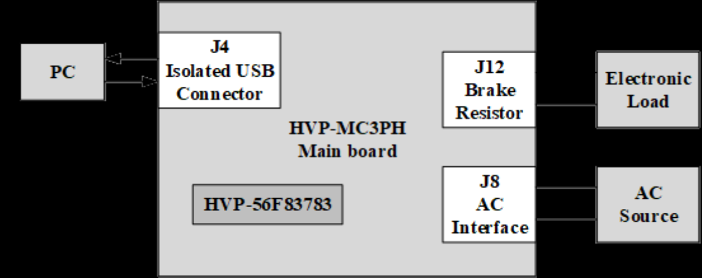

Both boards are ready for the PFC development in their default configuration, so no jumper setting is needed before running the
application. The load is connected through the brake resistor connector J12. The high-voltage power stage can be supplied from
the grid or AC source. The supply voltage range is 90-240 VAC. To work properly, note that if an electronic load is used to test the
HVP-MC3PH, it is necessary to add an isolated transformer between the grid and the electronic load. The PE on the HVP-MC3PH
board should not be connected with the grid earth, such as adding an isolated transformer between the grid and the HVP-MC3PH.
If it is necessary to connect the PE on the board with earth for safety consideration, remove the C19 and C20 capacitors from the
HVP-MC3PH board.

## 4. Results
A programmable AC source, **Chroma, model 61704**, is used as AC voltage input for below tests.

|Input AC voltage(V)|Electric load(W)|Power factor|
|-----------|-----|------|
|220|199.85|0.987|
|220|400.5|0.992|
|220|600|0.997|
|220|800|0.997|
|110|100.83|0.99|
|110|200|0.996|
|110|300|0.998|
|110|400|0.998|

Oscilloscope waveforms show the performance of PFC. Probe channels are assigned with physic signals as below. 
- Channel 1 is input AC voltage
- Channel 4 is input current
- Channel 3 is DC bus voltage
> ***220VAC, 50Hz with no load***
> 
> Because the load is very light, PFC works at burst mode and the burst-off time is much longer than the burst-on time.
> 
> 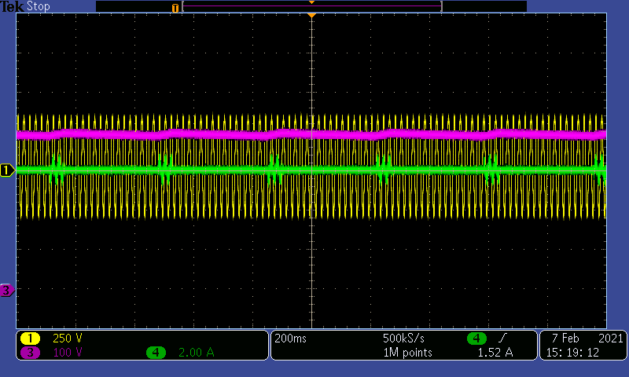
>
> Input current and voltage are in the same phase during burst-on time.  
> 
> 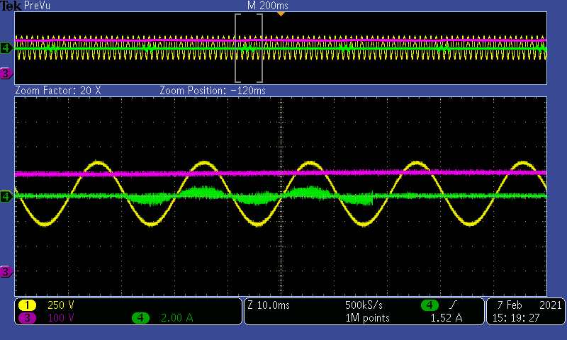

> ***220VAC, 50Hz with 30W motor load***
> 
> The entire load is contributed by the motor running, and there is no load on motor shaft. So the DC bus load is also light, but a bit larger than no load. PFC still works at burst mode. Now burst-on time is longer than burst-off time.
> 
> 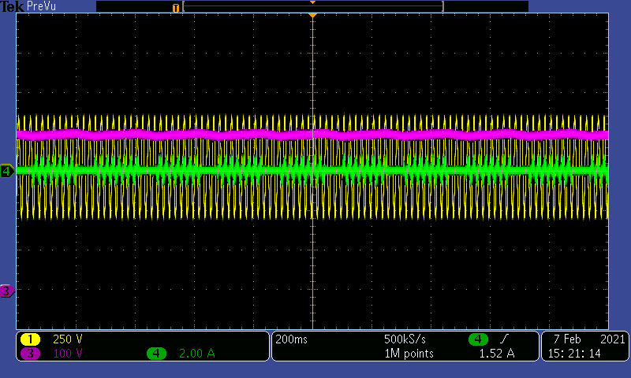
> 
> Input current and voltage are in the same phase during burst-on time. 
> 
> 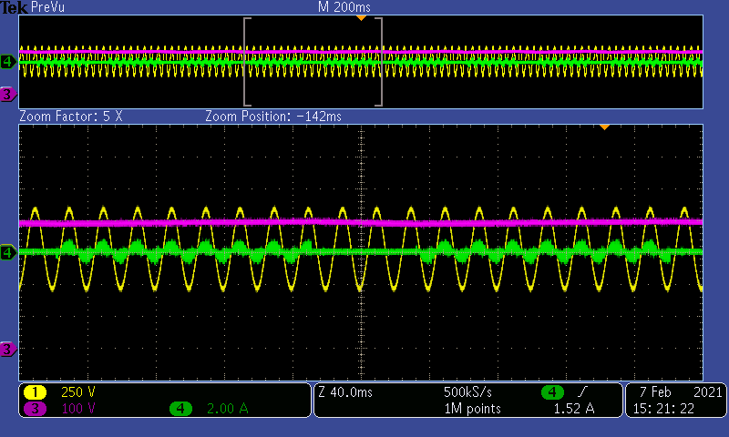
>
> Motor runs at 2000RPM with no load on the shaft. DC bus voltage, state machine index and speed are captured in FreeMASTER scope during the startup. See below figure. 
> 
> 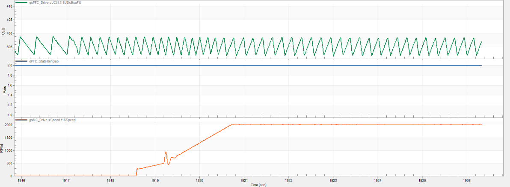

>***220VAC, 50Hz with 400W electric load***
>
> PFC works at normal mode in this case. DC electric load is added through braking resistor connector.
> 
> 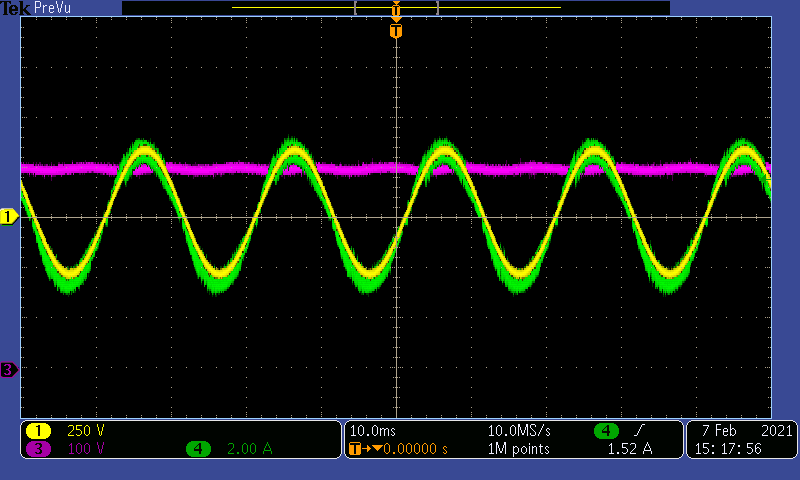

>***220VAC, 50Hz 0W to 800W load transition***
>
> When 800W load is added abruptly, PFC goes from burst mode to normal mode immediately. DC electric load is used for this test. Sampled DC bus voltage can be seen in FreeMASTER scope as well.
> 
> 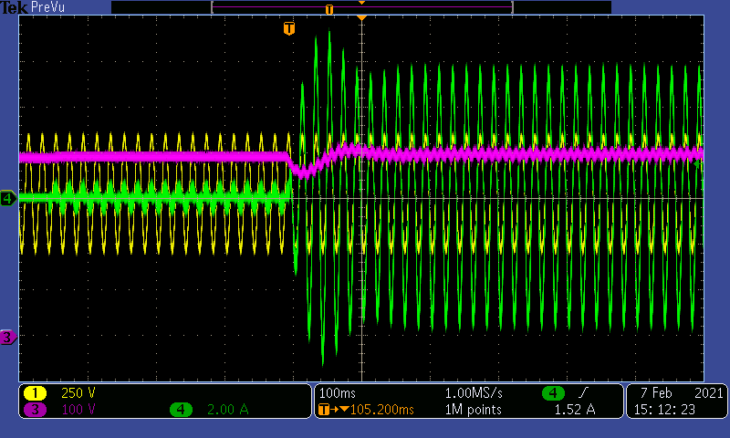
> 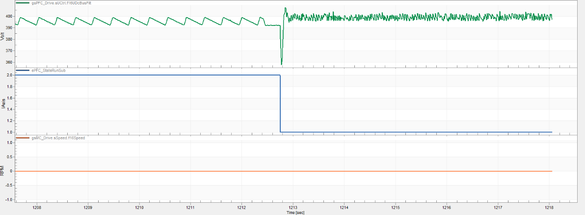
>
> ***220VAC, 50Hz 800W to 0W load transition***
> 
> When 800 W load is taken away abruptly, PFC goes from normal mode to burst mode immediately. DC electric load is used for this test. Sampled DC bus voltage can be seen in FreeMASTER scope as well.
> 
> 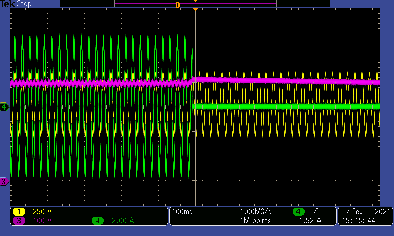
> 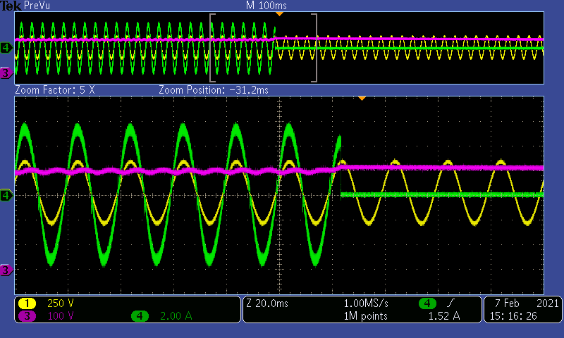
> 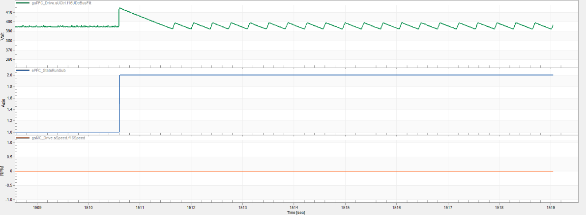

## 5. FAQs
**5.1 How to download the code into 56F83783?**

There is an isolated JTAG circuit on HVP-56F83783 daughter card. Use Multilink together with CodeWarrior to realize image programming and debug. For more information on HVP daughter card, please refer to [User Manual of HVP-56F80748](https://www.nxp.com/docs/en/user-manual/HVP-56F80748-UM.pdf). The interface functionalities on HVP-56F83783 is the same with HVP-56F80748.

**5.2 What are the PFC and motor control algorithms used in this application?**

PFC adopts average current control with many compensation methods for light loading. Sensorless FOC with state observer(from [RTCESL](https://www.nxp.com/rtcesl)) is used for motor(PMSM) control. Detailed control theory and implementation description can be found in chapter 2/3/5 of [AN13184.pdf](https://www.nxp.com/docs/en/application-note/AN13184.pdf). 

**5.3 How to use FreeMASTER to control the system**

Get a basic idea of FreeMASTER with [FreeMASTER User Guide](https://www.nxp.com/docs/en/user-guide/FMSTERUG.pdf). Go to [NXP community FreeMASTER Support Portal](https://community.nxp.com/t5/FreeMASTER/bd-p/freemaster) or [FreeMASTER landing page](https://www.nxp.com/freemaster) for more information if desired. Then follow the instructions in chapter 6.2 of [AN13184.pdf](https://www.nxp.com/docs/en/application-note/AN13184.pdf). 

## 6. Support
#### Project Metadata
<!----- Boards ----->

<!----- Categories ----->
  

<!----- Peripherals ----->
   

<!----- Toolchains ----->

Questions regarding the content/correctness of this example can be entered as Issues within this GitHub repository.

>**Warning**: For more general technical questions regarding NXP Microcontrollers and the difference in expected funcionality, enter your questions on the [NXP Community Forum](https://community.nxp.com/)

## 7. Release Notes
| Version | Description / Update                           | Date                        |
|:-------:|------------------------------------------------|----------------------------:|
| 1.0     | Initial release on Application Code HUb        | June 14th 2023 |

